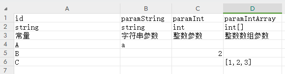
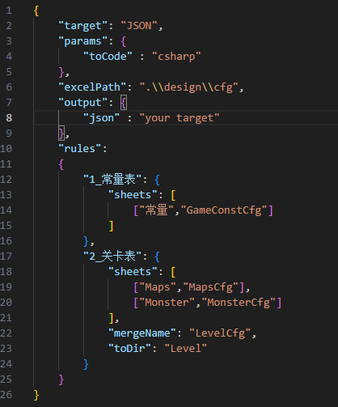

# **EasyFramework** 

## **1.Client 为 Unity游戏框架 集成了 HyBridCLR**
    
  ### 资源管理(AssetsMgr)
    可使用自带EasyAsset和Addressable
    EasyAsset 实现热更,边玩边下,资源分包DLC,加解密,资源去重,引用计数释放
  ### 文件管理(FileMgr)
    实现文件加解密
  ### 配置管理(ConfigMgr)
    配合转表工具使用
  ### 事件管理(EventMgr)
    手动注册反注册事件,通过属性自动注册反注册事件,线程安全事件
  ### 协程管理(CoroutineMgr)
  
  ### 有限状态机(FMSMachine)
  
  ### 多语言(I18NMgr)
  
  ### 输入管理(InputMgr)

  ### UI管理(UIMgr)
    实现层级管理,弹窗管理
  ### 启动流程  
    实现了单例模块的加载顺序,卸载重载
  
## **2.Execl为配置表转换工具**

  可将Excel表转换为 Flatbuffers,ProtoBuffers,JS,TS,JSON

  ### design -- 表目录  
  
    
    第一行为变量名 
  
    第二行为变量类型

    第三行为解释

  ### input -- 自定义输入
  
    
    target 为转换目标语言 (Flatbuffers,ProtoBuffers,JS,TS,JSON 可选)
    
    params/toCode 当使用 Flatbuffers,ProtoBuffers 时,可转换出对应的解析代码

    execlPath 表路径

    output 会将转出的tmp下的子文件,拷贝到设置的对应目录,左值为tmp下的对应文件夹名字

    rules 转表规则
        sheets 下配置表页签,以及转出的名字
        mergeName 可以将几个页签合并到一个文件
        toDir 输出的目录

  ### 执行
    当配置好表和转表参数后即可转表
    执行 gen.bat 

## **3.详细信息有需要时补充**
    
